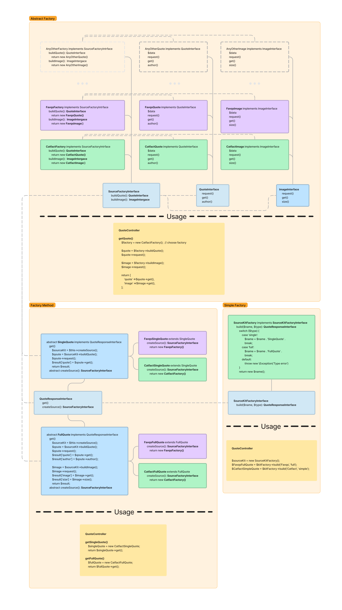

# Laravel examples #
### One of the problems of a programmer is that you can't show your most advanced and complex code because it's commercial. This repository will show you what I can do with Laravel and how I use some patterns and principles when writing code. ###

## Examples of using different programming approaches ##

### strict_types ###
declare(strict_types=1) - strong typing improves performance and reduces bugs. I use this in every file I create.

### Resources ###  
One of the use cases for resources is the pre-known and controlled output of information. The model may change during development. As a result, confidential information may be compromised. To avoid this, you can use Resources.  
The resource can be used for a single object or for a collection of objects.  
*Examples:*  
Without rosource: [list method](app/Http/Controllers/QuoteRequestController.php)  
Single object: [show method](app/Http/Controllers/QuoteRequestController.php)  
Collection of objects: [list and show methods](app/Http/Controllers/QuoteSourceController.php)  

### Interfaces ###  
Interfaces in laravel are called - Contracts. The framework's standard contracrs can be found at vendor/laravel/framework/src/Illuminate/Contracts  
I have created several contracts and they are used in every quote/image source.  
*Examples:*  
[Contracts (Interfaces)](app/Contracts)  
[Sources (Classes)](app/Services/Sources)

### Abstract Factory ###
Since we have several quote/image sources and they all implement the same interface, we can create a Factories. The factories will return a specific object. 
Now we can add more sources with different logic and Factories to use them.
*Examples:*  
[Contract (Interface)](app/Contracts/SourceFactoryContract.php)  
[Factories](app/Factories) - creates and returns objects.  
Usage: [update method](app/Http/Controllers/QuoteRequestController.php)  

### Factory Method ###
Abstract factories can have many different methods, and we can create multiple sets of these methods. Using factories in this way is called Factory Method.  
I created 2 quote sets in this project using an abstract class and final classes that extend them. Now I can use the final classes on the controller without having to request the whole set of methods.  
*Examples:*  
[Contract (Interface)](app/Contracts/QuoteResponseContract.php)  
[Full Set Abstract class](app/Services/Responses/Full/FullQuote.php)  
[Simple Set Abstract class](app/Services/Responses/Single/SingleQuote.php)  
[Sets](app/Services/Responses/)  

### Simple Factory ###
I'm using a simple factory to get a specific object based on input.  
*Examples:*  
[Contract (Interface)](app/Contracts/SourceKitFactoryContract.php)  
[Simple Factory](app/Factories/SourceKitFactory.php)  

### Diagram ###

[This diagram in Figma](https://www.figma.com/file/Y5zck9Dn8luq3QGimqzf7b/Laravel-Examples?node-id=45%3A266&t=df6FGK6lEJIuh7nO-1)

### Sessions and unique tokens ###
How to determinate user while showing request information?  
One way is to use Laravel sessions. You can put some information into the session and validate it when the user makes a request.  
How to hide request id to prevent information disclosure?  
You can generate a unique random token when starting a conversation and store it in the session. Reflash this session while the conversation is in progress, and reset when the final answer is given.  
*Examples:*  
My interpretation contains [Signature service](app/Services/Signature.php) with unique token, hash and validation methods. I use the [ValidateInternalSignature](app/Http/Middleware/ValidateInternalSignature.php) middleware to validate requests.  
Middleware is used by the "back" group in [web routes](routes/web.php).  

### Tests ###
In this project, the tests were created after the code was written. And they helped to find some errors with types and show problem areas for the next refactoring.  
*Examples:*  
[Feature tests](tests\Feature)  

### Other interesting parts ###
- Changing the response code on failed validation: [failedValidation method](app/Http/Requests/StoreQuoteRequestRequest.php)  
- Using Laravel Query Builder instead of Eloquent ORM: [getFiltered method](app/Services/QuoteRequestService.php)  
- Using data from related tables in [Resource](app/Http/Resources/ListQuoteRequestResource.php)  

### PSR ###
PSR-12 - Extended Coding Style. I use this spec when writing all my code and always check before committing.

### The logic of working (on the example of Postman) ###
1. Import Postman [environment and collection](documentation/postman)
2. Set Development environment.
3. Administrative part starts with Auth:
    - csrf
    - login
    - any other requests
4. Customer side:
    - POST request to /quoterequest - send an external id and get a redirect link to the front page. This link contain **token** after #. For example: http://localhost/#psfmYhZ1Uu
    - GET request to /back/quoterequest/{token} - should contain **token** from the redirect link. This request will return information about qurrent request.
    - GET request to /back/quotesources/{token} - should also contain **token** from the redirect link. Returns quote sources available for this request.
    - PUT request to /back/quoterequest - should contain the id of the quote source. Returns a quote!

## Branches ##
This project follows the **gitflow** branching model. And [Trello](https://trello.com/b/59M7MZHU/laravel-examples) is used for task tracking

**MAIN** - Stores the official release history. Current version is 1.0

release/**1.0** - v1.0

**Develop** - Integration branch for features. All magic happens here! 🪄

feature/**LE-11** - Add feature tests for all endpoints in api and web roures.

feature/**LE-10** - Update to new Laravel version - 10. Clean up some PhpDoc due to using PHP Native Type Declarations. Refactoring of contracts and factories, checking for missing types and making sources more tastable.

feature/**LE-9** - Factory method: use previously created abstract factories on special Response services. Created methods to get different types of responses in SourceKitFactory. And Simple factory design pattern in SourceKitFactory.  

feature/**LE-8** - Created an Abstract Factory and changed the implementation of the request to get information about the quote in the controller. Removed classes that are no longer used.  

feature/**LE-7** - Refactoring all previous code and looking for ways to improve it. Fixed method and variable names not matching PSR-12. Adding declare(strict_types=1) and missing PhpDoc.

feature/**LE-6** - Adding a Signature service to create unique tokens, signatures and verify them. Add token to hide internal number of request. Change the working logic from using an id to a token. Adding the Postman collection to the project.

feature/**LE-5** - Adding fake quote requests to the database. Creating filtering and pagination logic in the quoterequest/list route. Creating a QuoteRequestService to move the filtering logic from the controller to a separate service.

feature/**LE-4** - Adding interface (Contract) for Quote source. Creation of 3 sources of quotes as an example. Each source uses its own implementation of the contract. Creating a 'factory method' to get the QuoteSource object and developing client and administrative parts of the project.

feature/**LE-3** - Adding a QuoteRequest as a client request entity for a new quote. Store this query in the database and redirect the user to the main page. Creation of an administrative part (api) to get a list of client requests and a list of available statuses.

feature/**LE-2** - Adding and configuring Fortify with Sanctum. Create a user seeder and resource. Return authorized user through a resource.

feature/**LE-1** - Initializing an empty Laravel project to start from the beginning. And creating first branch by the gitflow model.
